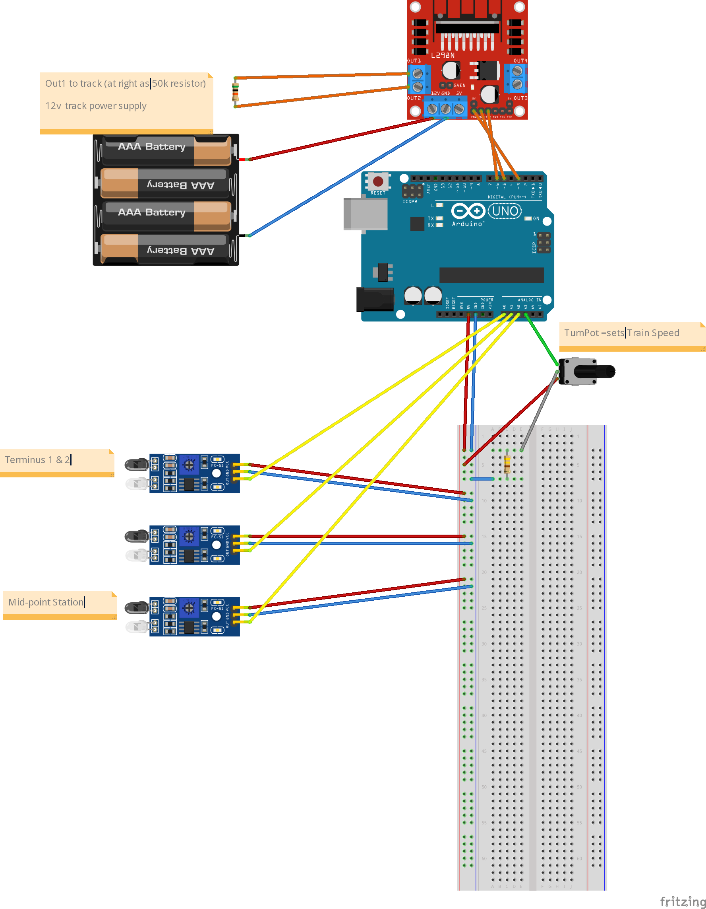

# DIY Jimmy's Three Station Railroad Arduino Demo

[DIY and Digital Railroad](https://www.diyanddigitalrr.com/)

https://youtu.be/PoOxFS2DNpI?si=a4vY9Ln4eqhzoHmL

> Nov 1, 2021  **Arduino Projects**: Today we are making a fully automated model train setup using an arduino, a motor driver, and some infrared sensors!

## Parts

* [Kato Pocket Line Tram](https://shorturl.at/hkKVY)
* [Arduino UNO](https://amzn.to/3jTbDJ4)
* [L298N Motor Driver](https://amzn.to/3EuMgVJ)
* [Infrared Sensors](https://amzn.to/3nIqsPD)
* [Resistor](https://amzn.to/3CBtPxS)
* [Rotary Potentiometer](https://amzn.to/3mwkIZN)
* [Wires](https://amzn.to/3GwYFtY)
* [Breadboard](https://amzn.to/3w0KIjg)
* [Power Supply](https://amzn.to/3jSOkPx)
* [Barrell Plug Adapter](https://amzn.to/31j3Iya)

## Circuit Diagram

## Notes

I'll do an initial commit exactly as Jimmy wrote it. Then I'll refactor for readability.

Direction of travel -- "Left" or "Right", "Forward" or "Reverse" -- are completely arbitrary, so pick and move on.
